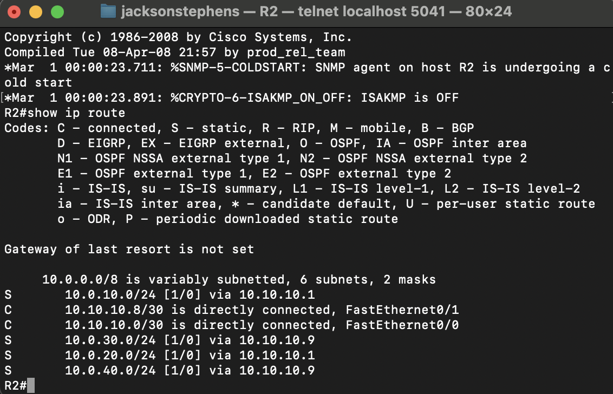

 

Network Topology: 
 

 

Router 1 Static Routes:
 

 

Router 2 Static Routes:
 

 

EtherSwitch 10 Static Routes:
 

 

EtherSwitch 20 Static Routes:
 

 

Ping Testing: 
 

 

Ping Testing: 
 

 

Ping Testing: 
 

 